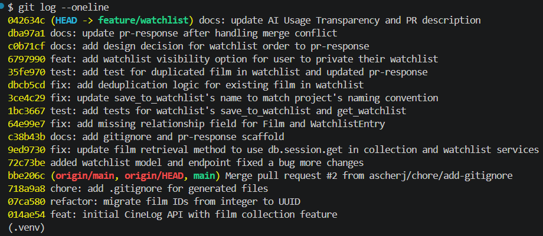

# PR Response Doc — CineLog Watchlist Feature

## AI Usage

I used Claude (Claude Code) throughout this project in several ways:

**Codebase orientation.** I asked AI to summarize `models.py` and explain the test patterns in `test_collection.py` before reading the review comments. This helped me understand the naming conventions, how deduplication was handled in `add_to_collection`, and what fixture structure the tests expected — which made Comments 1–3 much clearer.

**Test scaffolding.** I asked AI to generate `tests/test_watchlist.py` following the same fixture and assertion structure as `test_collection.py`. I reviewed the output, caught issues (a missing `film` relationship on `WatchlistEntry`, wrong column type for `fake_film_id`), and fixed them. I also directed which tests to add and what behavior to assert.

**Stress-testing design arguments (Comments 4 and 5).** After drafting my initial responses, I asked AI what counterarguments a reviewer might raise. For Comment 4, AI surfaced that CineLog is a community app and private-by-default works against its core purpose — which led me to reverse my position to public-by-default. For Comment 5, AI flagged that alphabetical order is easier to scan for large lists, which I incorporated as the tradeoff acknowledgement. The final arguments are my own reasoning, shaped by engaging with those counterpoints.

**Git debugging.** I used AI to diagnose why `git rebase origin/main` completed without conflict markers — it identified that `WatchlistEntry` was in the common ancestor rather than added by a feature branch commit, so git had nothing to replay when main deleted it.

**Commit message audit.** I ran my `git log --oneline` output through AI to check conventional commit format compliance before the final rebase.

## Comment 1 — Rename
**What I did:** I looked up `save_to_watchlist`'s callsites using VS Code's `Find All References` and doubled check with search functionality. Then I renamed to function to `add_to_watchlist` and also traced the other references and renamed them as well.
**How I verified:** I checked with search functionality on `save_to_watchlist` again and found no match. Then, I started `FLASK_APP=app:create_app flask run` up with no compile error. I also added test cases for watchlist and ran `pytest tests/ -v` with all green. I called POST `/watchlist/1/add` to check the call still works.

## Comment 2 — Deduplication
**What I did:** I looked at `add_to_collection` and created a a new error `AlreadyInWatchlistError` to be raised when the film is found to exist in the user's watchlist already. This error is separated from the collection error to provide clear separation and clarity on collection vs watchlist being different.
**How I verified:** I started up the app with `FLASK_APP=app:create_app flask run` with no compile error, made the same POST call `/watchlist/1/add` with `{"film_id": "2"}` as the previous call and confirmed `services.watchlist_service.AlreadyInWatchlistError: Film '1' is already in this user's watchlist` is present in server log.

## Comment 3 — Missing test
**What I did:** I accidentally added the tests that cover the watchlist prior to the rename fix commit. I referenced tests in the existing `./tests/test_collection.py` for the code pattern and applied to all test cases in `watchlist_service.py`
**How I verified:** I ran `pytest tests/ -v` and confirmed tests passed with 100% with all new tests visibly added.

## Comment 4 — Default visibility
**My position:** I decided to set the default visibility for a user's watchlist to be public, unless specified.
**Reasoning:** The platform is a community app for users to share films they have watched, their ratings, and what they want to watch. By setting default visibility to public, the user's watchlist is immediately discoverable by fellow CineLoggers. If the user prefers to keep the list private, they can manually set their list to private.
**Tradeoff acknowledged:** With this decision, the user would need to take an extra step to manually set watchlist's private visibility. This reduces privacy, but I believe that this would provide them a better discovery and sense of control rather than having dead-on-arrival discoverability if users never set their visibility to public if default is private.

## Comment 5 — Sort order
**My position:** I agree that most recently added film is more relevant than the title order.
**Reasoning:** The most recently added film indicates that it has recently caught the attention of the user, which also indicates the most up-to-date genre interests. The older added film could also be an outdated interest that the user once wanted to watch, but not anymore. If ordered by alphabetical order, it would be helpful with finding title based on the name, but it does not provide as much context catered to user's current interests. 
**Engagement with reviewer's point:** I can agree with the reviewer on this point that the most recently added film corresponds more to user's recent interests in film. This would help the user navigate through their list and find what to watch next faster and it is contextually more informative than providing a list ordered by name. The tradeoff is that date-added order makes it harder to scan a large list by name, but for a watchlist whose primary purpose is deciding what to watch next, recency is more useful than alphabetical position.

## Comment 6 — Rebase
**What conflicted:** The UUID refactor commit on `main` deleted `WatchlistEntry` from `models.py` entirely, since it was not part of `main`. Because `WatchlistEntry` was already present in the common ancestor rather than added by a feature branch commit, git had nothing to replay and silently dropped it during the rebase.
**How I resolved it:** After the rebase completed, I manually re-added `WatchlistEntry` to `models.py` with `film_id = db.Column(db.String(36), ...)` to match the UUID type now used by `Film.id`, then folded that fix into the original watchlist model commit using `git rebase -i`.
**How I verified no conflict remains:** I ran the Flask app with no errors and confirmed all endpoints respond correctly. Ran `pytest tests/ -v` with 100% passing rate.

## PR Description

This PR adds a watchlist feature to CineLog — a way for users to save films they want to watch later, separate from their collection of films they've already seen. Users can add films to their watchlist, optionally set visibility, and retrieve their list sorted by most recently added.

**Design decisions:**

- **Default visibility: public.** Since CineLog is a community app, watchlists default to public so they're immediately discoverable by other users. Users who prefer privacy can explicitly pass `"public": false` when adding a film.
- **Sort order: most recently added first.** A recently added film is more likely to reflect what a user actually wants to watch right now. Alphabetical order is easier to scan by name, but for a watchlist's primary purpose — deciding what to watch next — recency is more useful.

**How to test manually:**

1. Start the app: `FLASK_APP=app:create_app flask run`
2. Seed the database: `py seed.py` — note a user ID and a film ID from the output
3. Add a film to the watchlist:
   ```
   POST /watchlist/<user_id>/add
   Body: { "film_id": "<film_id>" }
   ```
4. Confirm the entry is returned:
   ```
   GET /watchlist/<user_id>
   ```
5. Try adding the same film again — confirm a `409` or error response (deduplication)
6. Add a private entry by passing `"public": false` in the request body, confirm `public` field in response
7. Add multiple films and confirm the list is sorted by most recently added

